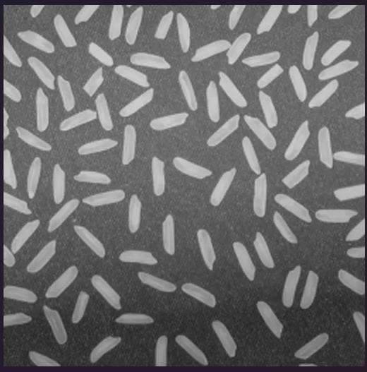

# Operating Systems task: ext2 parser

A C++ program that reads a raw ext2 filesystem image, prints its layout, pulls
files out of it, and writes back to it. Both bonus parts are included.

Built and run on Linux.

## Building

```
make                 # builds ./ext2fs
make debug           # -O0 -g plus the address/UB sanitizers
make check           # quick run over the disk image
```

Needs g++ with C++17 (g++ 13.3.0 was used here).

```
./ext2fs <image> super                      # superblock
./ext2fs <image> groups                     # block group descriptors
./ext2fs <image> tree                       # whole directory tree
./ext2fs <image> inode <path|num>           # one inode and where its blocks are
./ext2fs <image> cat <path|num>             # contents to stdout
./ext2fs <image> extract <path|num> <out>   # contents to a file

./ext2fs <image> append <path|num> <text>
./ext2fs <image> overwrite <path|num> <text>

./ext2fs <image> threads <n>                # bonus 1
./ext2fs <image> race <n> <path|num>...     # bonus 2
```

Files can be named by path or by raw inode number. The write commands open the
image read-write, so copy it first.

## Layout

| file | contents |
|---|---|
| `src/ext2.h` | the on-disk structs and nothing else |
| `src/ext2fs.h` / `.cpp` | the filesystem code |
| `src/main.cpp` | command line handling, plus the two concurrency demos |
| `scratch/main_first_attempt.cpp` | the first single-file version, kept for reference |

## Status

- [x] Read core structures (superblock, block group descriptors)
- [x] Traverse directories recursively
- [x] Read file contents, any size, including indirect blocks
- [x] Update existing files (append and overwrite, with block allocation)
- [x] Bonus: lock-free concurrent reads
- [x] Bonus: minimal block locking for writes

## Task 1: superblock and group descriptors

The superblock sits at byte 1024 and is always 1024 bytes long. It has to live
at a fixed *byte* offset rather than a block number, because the block size is
one of the things stored inside it.

The descriptor table starts on the block after whichever block holds the
superblock. With 1K blocks the superblock fills block 1, so the table is block
2; with larger blocks the superblock is swallowed by block 0, so the table is
block 1. Using `s_first_data_block + 1` handles both cases.

```
$ ./ext2fs Artifacts/disk-backpup.img super
superblock, byte 1024

  magic               : 0xEF53  ok, this is ext2
  revision            : 1.0
  state               : clean

  block size          : 1024 (1024 << 0)
  total blocks        : 12288
  free blocks         : 7582
  first data block    : 1
  blocks per group    : 8192

  total inodes        : 3072
  free inodes         : 3022
  inodes per group    : 1536
  inode size          : 256 (struct is 128, stride by the bigger one)

  worked out from the above:
  block groups        : 2
  pointers per block  : 256 (1024 / 4)
  bits per bitmap blk : 8192 which matches blocks per group
```

A group holds 8192 blocks, and one bitmap block is 1024 bytes, or 8192 bits.
The group size follows from that: a group is however many blocks a single
bitmap block can keep track of.

```
$ ./ext2fs Artifacts/disk-backpup.img groups
block group descriptors, 2 groups, table starts at block 2

  group  blk bitmap  ino bitmap  ino table  free blks  free inos  dirs
  0      50          51          52         4954       1494       29
  1      8242        8243        8244       2628       1528       8

  group 0 has inodes 1 to 1536
  group 1 has inodes 1537 to 3072
```

Inodes past 1536 live in group 1, which is what the traversal section runs
into.

## Task 2: directory traversal

A directory is a file whose data blocks hold a list of entries, each pairing a
name with an inode number. The entries are variable length: an 8 byte header,
then the name, with `rec_len` giving the distance to the next one.

The first version declared `char name[255]` inside the entry struct, which made
`sizeof` 264 while real entries on disk are often 12 or 16 bytes. Every read
overshot, so the file position had to be seeked *backwards* by the difference
each time round the loop. Dropping the name out of the struct and reading it
from a block buffer instead removed that entirely.

```
$ ./ext2fs Artifacts/disk-backpup.img tree
d /                        inode=2      size=1024
  d lost+found/              inode=11     size=12288      i_blocks=24
  - readthis.txt             inode=12     size=38         i_blocks=2
  d dir1/                    inode=1537   size=1024       i_blocks=2
    d innerdir1/               inode=1538   size=1024       i_blocks=2
    d innerdir2/               inode=1541   size=1024       i_blocks=2
    d innerdir3/               inode=13     size=1024       i_blocks=2
      - comp-dsa.pdf             inode=16     size=1099959    i_blocks=2162
    d innerdir4/               inode=17     size=1024       i_blocks=2
...
    d innerdir6/               inode=40     size=1024       i_blocks=2
      - rice.webp                inode=14     size=25626      i_blocks=54
  d dir5/                    inode=43     size=1024       i_blocks=2
    d innerdir3/               inode=44     size=1024       i_blocks=2
      - vid.webm                 inode=15     size=2728014    i_blocks=5354
```

`lost+found` is 12288 bytes, which is 12 blocks. The early version only read
`i_block[0]`, so it was displaying a twelfth of that directory with no sign
anything was missing.

Path lookup is the same walk with a name comparison instead of a print, so
`/dir1/innerdir3/comp-dsa.pdf` resolves to inode 16 by starting at inode 2 and
following one component at a time. The kernel calls this `namei`.

## Task 3: reading file contents

`i_block[]` has 15 slots, so a file cannot name more than 15 blocks directly.
ext2 spends the last three on blocks that are themselves full of block numbers:

- slots 0 to 11 point at data, so 12 blocks
- slot 12 points at a block of 256 pointers
- slot 13 points at a block of pointers to blocks of pointers
- slot 14 adds one more level

All of this lives in one function, `block_for(inode, n)`, which takes the
file's n'th block and returns the block number on disk. Everything else in the
program asks for "block n" and never finds out which level answered.

The files on the image cover all three cases:

| file | size | needs |
|---|---|---|
| `readthis.txt` | 38 B | direct only |
| `rice.webp` | 25 KB | singly indirect |
| `comp-dsa.pdf` | 1.07 MB | doubly indirect |
| `vid.webm` | 2.73 MB | doubly indirect |

```
$ ./ext2fs Artifacts/disk-backpup.img inode /dir5/innerdir3/vid.webm
inode 15

  found in            : group 0 index 14 (table block 52)
  type and perms      : - rw-r--r--
  size                : 2728014 bytes
  i_blocks            : 5354 sectors = 2677 blocks
                      : the data only needs 2665, the rest are indirect blocks

  i_block[]:
    [0 ] direct          1041
...
    [11] direct          1052
    [12] singly indirect 478
    [13] doubly indirect 479
    [14] triply indirect 0   unused

  where the blocks actually are:
    block 0        -> 1041     (direct)
...
    block 2664     -> 2665     (doubly)
```

Extracting the binary files is a good check, because an off-by-one in the
`% 256` gives a file of exactly the right length that is garbage inside:

```
$ ./ext2fs Artifacts/disk-backpup.img extract /dir4/innerdir6/rice.webp rice.webp
wrote 25626 bytes to rice.webp
$ file rice.webp
rice.webp: RIFF (little-endian) data, Web/P image
```

`debugfs` can dump the same file, so the two can be compared directly:

```
$ debugfs -R "dump /dir4/innerdir6/rice.webp ref.webp" Artifacts/disk-backpup.img
debugfs 1.47.0 (5-Feb-2023)
$ cmp rice.webp ref.webp
$
```

`cmp` printing nothing means they are identical. The same check passes for
`comp-dsa.pdf` and `vid.webm`, which both go through the doubly indirect
level.

Opening the extracted copy shows the same picture, so the bytes are not just
the right length:



## Task 4: updating files

Most of the work in a write is the metadata around it. Growing a file
means:

1. finding a free bit in the block bitmap and setting it
2. putting the block number in the right `i_block` slot, allocating the
   indirect block first if the file has gone past slot 11
3. decrementing `bg_free_blocks_count` for that group
4. decrementing `s_free_blocks_count` in the superblock
5. updating `i_size`, `i_mtime` and `i_blocks`

`i_blocks` counts 512 byte sectors rather than filesystem blocks, so every
value on this image is double what you would expect, and it counts indirect
blocks as well as data. `rice.webp` has 26 data blocks plus 1 indirect block,
and 27 x 2 = 54, which is what its inode says.

`e2fsck` audits every counter independently, so it catches mistakes the
program itself would report as success:

```
$ cp Artifacts/disk-backpup.img test.img
$ ./ext2fs test.img append /readthis.txt "$(python3 -c "print('q'*14000,end='')")"
inode 12 is now 14038 bytes
$ e2fsck -fn test.img
e2fsck 1.47.0 (5-Feb-2023)
Pass 4: Checking reference counts
Pass 5: Checking group summary information
test.img: 50/3072 files (8.0% non-contiguous), 4720/12288 blocks

$ ./ext2fs test.img overwrite /readthis.txt "back to short"
inode 12 is now 13 bytes
$ e2fsck -fn test.img
e2fsck 1.47.0 (5-Feb-2023)
Pass 5: Checking group summary information
test.img: 50/3072 files (6.0% non-contiguous), 4706/12288 blocks
```

4706 is what the untouched image reports, so growing the file by 14 blocks and
then shrinking it handed every block back.

## Bonus 1: lock-free concurrent reads

A shared `FILE*` carries a read position. `fseek` writes it, `fread` reads it
and moves it, so two threads sharing one `FILE*` steal it from each other, and
a lock around them is protecting that single integer.

The image is `mmap`'d instead, which gives back a plain pointer and lets the
kernel page the file in as it is touched, so a read is a `memcpy` out of that
pointer with no position involved. Nothing is shared and mutable, so there is
nothing to lock.

An earlier version cached the indirect block lookups. That cache had to go,
since a cache is shared mutable state and would have reintroduced the race
that dropping the file position removed.

```
$ ./ext2fs Artifacts/disk-backpup.img threads 8
single thread: checksum 10869335705563985997 over 3853662 bytes
8 threads: all got the same checksum
read 30829296 bytes in 0.016883s = 1741.46 MB/s
```

Each thread reads the whole filesystem and checksums it, and all of them have
to match the single threaded answer. This only holds because nothing is writing
at the same time. With a concurrent writer a reader could catch a half updated
inode, and that would need real memory ordering.

## Bonus 2: minimal block locking for writes

Writes do need locks, but one lock over the whole disk would make a thread
appending to `readthis.txt` block a thread appending to `rice.webp` for no
reason. There is one mutex per inode instead, so threads writing to different
files never wait on each other.

Some contention is unavoidable. Both of those threads might need to allocate a
block, and the block bitmap and the free counters are genuinely shared, so
there is a second mutex for the allocator alone, held just long enough to
claim a bit.

```
$ ./ext2fs test.img race 8 /readthis.txt
8 threads x 20 appends, 0.106442s, 0 failures

inode 12: 38 -> 2678 bytes (expected 2678, 8 threads) ok

$ ./ext2fs test2.img race 4 /readthis.txt /dir4/innerdir6/rice.webp \
      /dir1/innerdir3/comp-dsa.pdf /dir5/innerdir3/vid.webm
4 threads x 20 appends, 0.0230407s, 0 failures

inode 12: 38 -> 368 bytes (expected 368, 1 threads) ok
inode 14: 25626 -> 25956 bytes (expected 25956, 1 threads) ok
inode 16: 1099959 -> 1100289 bytes (expected 1100289, 1 threads) ok
inode 15: 2728014 -> 2728344 bytes (expected 2728344, 1 threads) ok
```

Lost writes from bad locking would show up as files coming out short, so the
byte counts have to add up exactly. `e2fsck` is clean afterwards in both
cases.

## Disk image: `Artifacts/disk-backpup.img`

The image supplied with the task. 12 MB, 1024 byte blocks, 256 byte inodes, two
block groups, revision 1.

Every task was completed against this image: superblock and both group
descriptors read and cross-checked against `dumpe2fs`; the full tree traversed
(40 entries); all four files extracted and compared against `debugfs`; append
and overwrite with `e2fsck` clean afterwards; and both bonus demos run on
copies of it.

## Problems along the way

Inode numbers printed as letters. Output was showing `lost+found` at inode
`b` and `dir1` at inode `601`. `std::hex` had been used once to check the magic
signature hundreds of lines earlier, and the stream manipulators are sticky:
they stay switched on until something switches them back. The rewritten output
code builds its formatting in local string helpers so nothing leaks into
`cout`.

The root directory's `i_block[0]` read as 0, which would put the root
directory inside the boot sector. The offset was being calculated with
`sizeof(ext2_inode)`, or 128, but this image uses 256 byte inodes, so every
lookup landed halfway inside the previous inode and read padding. Revision 0
ext2 always used 128 byte inodes and had no field for it; revision 1 added
`s_inode_size` in space that used to be zero padding. The fix is to stride by
`s_inode_size` while still only reading the 128 bytes the struct covers.

Infinite loop printing blank lines, first attempt. Adding the recursive
call broke the parent loop, because both levels shared one `FILE*` and
therefore one read position. The recursive call left the position deep inside
the subdirectory, the parent's next `fread` picked up garbage, `rec_len` came
back as 0, and the counter stopped advancing. Saving the position before
recursing and restoring it afterwards fixed that part.

Infinite loop, second attempt. The original flat `while` loop was still
sitting in `main()` below the new recursive call, so it ran once the tree had
finished printing, with the read position by then at the end of the disk.
Deleting it was the fix.

Infinite loop, third attempt, and the actual cause. The loop still hung
on entering `dir1`. `dir1` is inode 1537, and `s_inodes_per_group` is 1536, so
it is the first inode of block group 1, not group 0. The code was using
group 0's inode table for every lookup, so anything past inode 1536 was being
read out of empty space. Working out the group from the inode number and using
that group's descriptor fixed it. This is also where the `-1` juggling gets
fiddly: the group index needs `(ino - 1) / inodes_per_group` and the index
within the group needs `(ino - 1) % inodes_per_group`, and getting the
subtraction wrong in either place sends the read somewhere harmless-looking but
completely wrong. The current version also sanity checks `rec_len` before using
it, so a bad block ends the loop instead of hanging it.

Indentation printed once per directory instead of once per entry, because
the loop printing the tab characters had been placed outside the `while` loop
rather than inside it.

The terminal appeared to freeze when running the program. This turned out to
have nothing to do with the ext2 code. `g++ main.cpp` had been run from the
parent folder, which holds an unrelated `main.cpp` from an earlier exercise, a
`wc` clone. With no arguments it sat waiting on standard input forever.
Changing into the right directory was the whole fix.

Printing a file blew the stack. The buffer was a stack array sized from
`i_size`. That is fine for a 38 byte text file and fatal for a 2.7 MB video.
The loop printing it also ran to `i <= i_size`, one past the end, which had been
silently printing a byte of uninitialised memory the whole time and happening to
get away with it. Reading a block at a time into one reused buffer replaced
both problems.

Appended text did not appear. The verification code was reading `i_size`
from a copy of the inode fetched *before* the append, so it printed the
original length and stopped short of the new text.

`struct stat file_stat` will not compile as `stat file_stat`. POSIX has
both a function called `stat` and a struct called `stat`, and in C++ they share
a namespace, so the `struct` keyword is needed to disambiguate. This is the only
struct in the program that needs it.

Blocks leaked on a refused write. `e2fsck` reported `Block bitmap
differences: -(487--488)`, meaning two blocks were marked in use with nothing
pointing at them. The write path allocated a block and *then* hit the doubly
indirect limit and threw, abandoning the block it had already claimed. The
program had reported a clean error both times. Fixed by checking the write fits
before allocating anything.

## Known limitations

- Growing a file into the doubly indirect range is not supported. Reading
  doubly and triply indirect files works, and so does appending to one while it
  still fits in the last block it already has. Allocating a genuinely new block
  past the singly indirect range refuses with an error instead. Nothing on this
  image comes close to that boundary and the bookkeeping is considerably more
  code. It fails before allocating anything, so the filesystem stays
  consistent.
- Little endian only. ext2 stores integers little endian and so does x86,
  so the structs can be copied straight over. A big endian machine would need
  every field byte swapped.
- No creating or deleting files. The task asked for updating existing ones,
  so there is no inode allocation, directory entry insertion or unlink.
- Files over 4 GB can be read but not written. `i_size` is 32 bits and
  revision 1 keeps the high bits in `i_dir_acl`; that is handled on read, but
  the write path only sets the low 32 bits.
- Reads are lock-free only because nothing writes concurrently. Mixing the two
  would need proper memory ordering.
